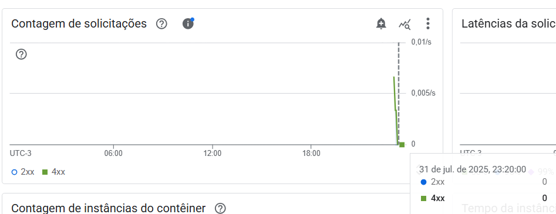
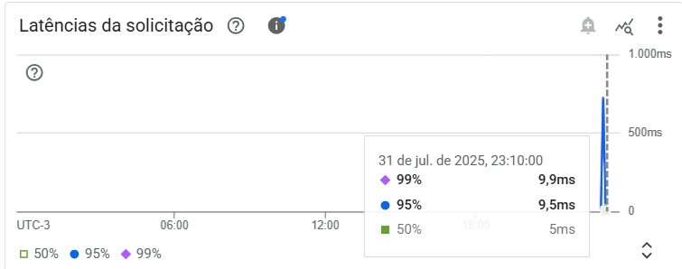
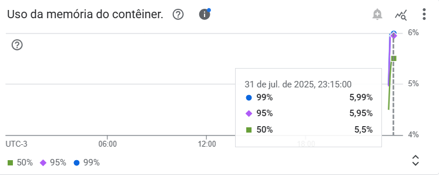

# 🌤️ Weather API

Bem-vindo ao **Weather API**, um projeto do meu portfólio que oferece uma **API RESTful escrita em Go** para consultar temperaturas com base em **CEPs brasileiros**.

A API integra:

- 🔎 **ViaCEP** para obter a localidade
- 🌡️ **WeatherAPI** para dados climáticos

Retorna temperaturas em **Celsius**, **Fahrenheit** e **Kelvin**.  
**Deployada no Google Cloud Run**, ela é escalável e pronta para uso! 🚀

---

## 📋 Descrição

O **Weather API**:

- Recebe um CEP brasileiro (8 dígitos) via endpoint:  
  ```
  /weather/:cep
  ```
- Consulta a **ViaCEP** para obter a localidade do CEP
- Usa a **WeatherAPI** para buscar a temperatura atual
- Retorna:

```json
{
  "temp_C": X,
  "temp_F": Y,
  "temp_K": Z
}
```

### ⚠️ Tratamento de Erros

- **CEP inválido** (ex.: menos de 8 dígitos):  
  Código: `HTTP 422`  
  Resposta:
  ```json
  {"message": "invalid zipcode"}
  ```

- **CEP inexistente** (ex.: 99999999):  
  Código: `HTTP 404`  
  Resposta:
  ```json
  {"message": "can not find zipcode"}
  ```

---

## 🧰 Tecnologias

- 🐹 **Go 1.22** — linguagem principal  
- 🐳 **Docker** — containerização  
- ☁️ **Google Cloud Run** — deploy serverless  
- 🔗 **Gorilla Mux** — roteamento HTTP  
- 🌍 **ViaCEP** e **WeatherAPI** — APIs externas  

---

## 🧪 Como Testar

A API está deployada no **Google Cloud Run**.  
Você pode testá-la com `curl` ou ferramentas como Postman.

🔗 Service URL:
```
https://weather-api-67802233489.us-central1.run.app/weather/
```

### ✅ CEP válido (ex.: São Paulo, SP)

```bash
curl -v https://weather-api-67802233489.us-central1.run.app/weather/01001000
```

**Resposta esperada**:
```json
{"temp_C": 24.5, "temp_F": 76.1, "temp_K": 297.65}
```

---

### ❌ CEP inválido (menos de 8 dígitos)

```bash
curl -v https://weather-api-67802233489.us-central1.run.app/weather/123
```

**Resposta esperada**:
```json
{"message": "invalid zipcode"}
```

---

### ❌ CEP inexistente

```bash
curl -v https://weather-api-67802233489.us-central1.run.app/weather/99999999
```

**Resposta esperada**:
```json
{"message": "can not find zipcode"}
```

---

## 📊 Métricas no Google Cloud Run

- 📈 **Contagem de Requisições**


##

- ⏱️ **Latência**


##

- 🧠 **Memória Container**



---

## 📁 Estrutura do Projeto

```
weather-api/
├── cmd/
│   └── server/
│       └── main.go           # Ponto de entrada da aplicação
├── internal/
│   ├── config/               # Configuração (variáveis de ambiente)
│   ├── handler/              # Handlers HTTP
│   ├── model/                # Modelos de dados
│   ├── service/              # Lógica de negócios
├── .env                      # Variáveis de ambiente (não versionado)
├── Dockerfile                # Definição do contêiner
├── docker-compose.yml        # Configuração para testes locais
├── go.mod                    # Dependências do Go
├── go.sum                    # Checksum das dependências
```

---

## 📜 Licença

Este projeto está licenciado sob a **licença MIT**.  
Consulte o arquivo [LICENSE](LICENSE) para mais detalhes.

---

